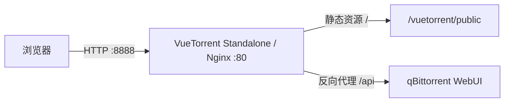

# VueTorrent Standalone

[English](README_en.md)

使用 Nginx 独立托管 [VueTorrent](https://github.com/VueTorrent/VueTorrent)，并将 Web API 请求反向代理到现有的 qBittorrent 实例。无需替换 qBittorrent 自带 WebUI，即可通过单独的端口访问 VueTorrent。

| 项目 | 说明 |
| --- | --- |
| Docker 镜像 | [`nukecat/vuetorrent-standalone`](https://hub.docker.com/r/nukecat/vuetorrent-standalone) |
| 支持架构 | `linux/amd64`、`linux/arm64` |
| 容器端口 | `80` |
| 上游项目 | [VueTorrent/VueTorrent](https://github.com/VueTorrent/VueTorrent) |
| 许可证 | [GNU GPL v3](LICENSE) |

## 快速开始

开始前，请确认 qBittorrent WebUI 已启用，并且运行本镜像的容器可以访问它。

下面的命令将 VueTorrent 发布到宿主机的 `8888` 端口。运行前，将 `QB_HOST` 的示例地址替换为实际的 qBittorrent 地址。

```bash
docker run -d \
  --name vuetorrent \
  --restart unless-stopped \
  -p 8888:80 \
  -e QB_HOST=http://192.168.1.100 \
  -e QB_PORT=8080 \
  nukecat/vuetorrent-standalone:latest
```

容器启动后，访问 <http://localhost:8888>，使用 qBittorrent 的账号和密码登录。

> `QB_HOST` 是容器内部能够访问的地址。请勿填写 `localhost` 或 `127.0.0.1`，除非 qBittorrent 与 Nginx 确实运行在同一个容器内。

## 项目简介

qBittorrent 只能直接启用一套 WebUI。该项目将 VueTorrent 静态文件放入独立的 Nginx 容器，并代理 `/api` 请求，使 VueTorrent 与 qBittorrent 原生 WebUI 可以同时使用。

项目本身不包含 VueTorrent 源码，也不实现 qBittorrent API。镜像构建时使用 VueTorrent 官方发布的 `vuetorrent.zip`。

### 核心功能

- 独立托管 VueTorrent 静态资源。
- 将 `/api` 请求转发到指定的 qBittorrent WebUI。
- 通过环境变量配置 qBittorrent 地址和端口。
- 自动跟踪 VueTorrent GitHub Release 并发布 Docker 镜像。
- 发布 `linux/amd64` 和 `linux/arm64` 多架构镜像。

## 系统架构



Nginx 的请求处理规则如下：

| 请求路径 | 处理方式 |
| --- | --- |
| `/` 及其他静态资源 | 从 `/vuetorrent/public/` 返回文件 |
| `/api` | 转发到 `${QB_HOST}:${QB_PORT}` |

上传到 `/api` 的请求体大小上限为 `20M`，该限制来自当前的 [Nginx 配置](nginx.template)。

## 技术栈

| 组件 | 用途 |
| --- | --- |
| VueTorrent | qBittorrent WebUI 前端，由上游 Release 提供构建产物 |
| Nginx 1.25 | 静态资源服务器和 API 反向代理 |
| Docker Buildx | 构建并发布多架构镜像 |
| GitHub Actions | 检查上游版本并自动发布镜像 |

本项目不使用数据库、消息队列或其他中间件。

## 配置说明

容器启动时通过 `envsubst` 将环境变量写入 Nginx 的 `default.conf`，然后启动 Nginx。

| 环境变量 | 必填 | 示例 | 说明 |
| --- | --- | --- | --- |
| `QB_HOST` | 是 | `http://192.168.1.100` | qBittorrent WebUI 的协议和主机名或 IP，不包含端口，不以 `/` 结尾 |
| `QB_PORT` | 是 | `8080` | qBittorrent WebUI 的监听端口 |

`QB_HOST` 可以使用 `http://` 或 `https://`。最终上游地址按以下形式生成：

```text
${QB_HOST}:${QB_PORT}
```

## 本地构建

### 环境要求

- Docker，且支持 `docker build`
- `curl`
- `unzip`
- 能够访问 GitHub Releases

### 1. 获取 VueTorrent 发布物

下面的命令下载 VueTorrent 最新 Release 中的 `vuetorrent.zip`，并解压为项目根目录下的 `vuetorrent/`。

```bash
curl --fail --location \
  --output vuetorrent.zip \
  https://github.com/VueTorrent/VueTorrent/releases/latest/download/vuetorrent.zip
unzip -q vuetorrent.zip
test -d vuetorrent/public
```

预期目录结构为：

```text
vuetorrent/
├── version.txt
└── public/
    ├── index.html
    └── assets/
```

### 2. 构建镜像

确认 `vuetorrent/public` 存在后，在项目根目录构建本地镜像。

```bash
docker build -t vuetorrent-standalone:local .
```

### 3. 启动本地镜像

下面的命令使用本地构建结果启动容器。请根据实际环境修改 qBittorrent 地址。

```bash
docker run -d \
  --name vuetorrent-local \
  -p 8888:80 \
  -e QB_HOST=http://192.168.1.100 \
  -e QB_PORT=8080 \
  vuetorrent-standalone:local
```

## 自动构建与发布

[GitHub Actions 工作流](.github/workflows/docker-release.yml)每天检查一次 VueTorrent 最新 Release，也支持手工指定版本运行。

自动发布流程会：

1. 从 `VueTorrent/VueTorrent` 解析指定或最新 Release。
2. 查找名为 `vuetorrent.zip` 的发布资产。
3. 检查对应的 Docker Hub 版本标签是否已经存在。
4. 下载并解压发布物。
5. 使用 Buildx 构建 `linux/amd64` 和 `linux/arm64` 镜像。
6. 推送版本标签和 `latest` 标签。

手工运行工作流时支持以下输入：

| 输入 | 默认值 | 说明 |
| --- | --- | --- |
| `version` | 空 | VueTorrent Release 版本，例如 `v2.33.0` 或 `2.33.0`；为空时使用 latest |
| `force` | `false` | 即使 Docker Hub 已存在对应版本标签，也重新构建并推送 |

> 每次实际构建都会同时更新版本标签和 `latest`。手工回填旧版本时需要特别注意，避免意外让 `latest` 指向旧版本。

多架构支持只适用于启用该构建配置后新发布或强制重建的镜像；历史标签是否包含 ARM64 变体应以 Docker Hub 的镜像清单为准。

## 项目结构

```text
.
├── .github/
│   └── workflows/
│       └── docker-release.yml  # 自动检查并发布 Docker 镜像
├── .gitignore                  # 忽略本地发布物和系统文件
├── Dockerfile                  # 基于 Nginx 组装运行镜像
├── nginx.template              # 静态文件与 /api 反向代理模板
├── README.md                   # 中文文档
├── README_en.md                # 英文文档
└── LICENSE                     # GNU GPL v3
```

`vuetorrent/` 和 `vuetorrent.zip` 是本地构建时生成的内容，已加入 `.gitignore`，不属于仓库源码。

## 部署注意事项

- 镜像只监听 HTTP `80` 端口。通过不可信网络访问时，应在外层反向代理或 Ingress 上配置 HTTPS。
- 当前模板没有配置上游 HTTPS 证书验证。生产环境使用 `QB_HOST=https://...` 前，应根据证书和网络信任模型扩展 Nginx 配置。
- 不建议将 qBittorrent 管理界面直接暴露到公网。请配合网络访问控制、强密码和 qBittorrent 自身的安全设置。
- 本项目不会自动修改 qBittorrent 的 Host Header、CSRF 或可信反向代理设置。

## 常见问题

### 页面可以打开，但无法连接 qBittorrent

依次检查：

1. `QB_HOST` 是否包含 `http://` 或 `https://`。
2. `QB_HOST` 是否错误地包含了端口或末尾 `/`。
3. `QB_PORT` 是否为 qBittorrent WebUI 的实际端口。
4. qBittorrent 是否允许来自该容器网络的连接。
5. 容器日志中的 Nginx 上游连接错误。

查看容器日志：

```bash
docker logs vuetorrent
```

### 登录或 API 请求返回 401

qBittorrent 会执行 Host Header 和 CSRF 检查。当前镜像只负责转发 `/api`，不会自动调整 qBittorrent 的安全设置。请检查 qBittorrent 的 WebUI 域名、CSRF 和反向代理配置是否与实际访问地址匹配。

### 修改环境变量后没有生效

Nginx 配置只在容器启动时生成。删除并使用新环境变量重新创建容器：

```bash
docker rm -f vuetorrent
```

然后重新执行“快速开始”中的 `docker run` 命令。

### API 文档在哪里

本项目不定义业务 API，因此没有独立的 Swagger、OpenAPI 或其他 API 文档入口。`/api` 是到 qBittorrent Web API 的反向代理；API 语义和版本以 qBittorrent 官方文档为准。

## License

本项目采用 [GNU General Public License v3.0](LICENSE) 许可。

VueTorrent 和 qBittorrent 分别由其各自项目维护，并适用各自的许可证。
