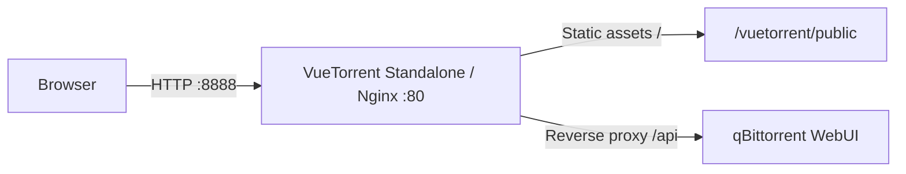

# VueTorrent Standalone

[中文](README.md)

Serve [VueTorrent](https://github.com/VueTorrent/VueTorrent) independently with Nginx and reverse-proxy Web API requests to an existing qBittorrent instance. This lets you use VueTorrent on a separate port without replacing qBittorrent's built-in WebUI.

| Item | Description |
| --- | --- |
| Docker image | [`nukecat/vuetorrent-standalone`](https://hub.docker.com/r/nukecat/vuetorrent-standalone) |
| Architectures | `linux/amd64`, `linux/arm64` |
| Container port | `80` |
| Upstream project | [VueTorrent/VueTorrent](https://github.com/VueTorrent/VueTorrent) |
| License | [GNU GPL v3](LICENSE) |

## Quick start

Before starting, make sure the qBittorrent WebUI is enabled and reachable from this container.

The following command publishes VueTorrent on port `8888` of the Docker host. Replace the example `QB_HOST` address with the address of your qBittorrent instance before running it.

```bash
docker run -d \
  --name vuetorrent \
  --restart unless-stopped \
  -p 8888:80 \
  -e QB_HOST=http://192.168.1.100 \
  -e QB_PORT=8080 \
  nukecat/vuetorrent-standalone:latest
```

After the container starts, open <http://localhost:8888> and sign in with your qBittorrent username and password.

> `QB_HOST` must be reachable from inside the container. Do not use `localhost` or `127.0.0.1` unless qBittorrent and Nginx are actually running in the same container.

## Overview

qBittorrent can directly enable only one WebUI at a time. This project places the VueTorrent static files in a separate Nginx container and proxies `/api` requests, allowing VueTorrent and the native qBittorrent WebUI to remain available at the same time.

This repository does not contain the VueTorrent source code and does not implement the qBittorrent API. The image is built from the official VueTorrent `vuetorrent.zip` release asset.

### Features

- Serve VueTorrent static assets independently.
- Proxy `/api` requests to a configured qBittorrent WebUI.
- Configure the qBittorrent host and port through environment variables.
- Track VueTorrent GitHub Releases and publish Docker images automatically.
- Publish multi-platform images for `linux/amd64` and `linux/arm64`.

## Architecture



Nginx handles requests as follows:

| Request path | Behavior |
| --- | --- |
| `/` and other static assets | Serve files from `/vuetorrent/public/` |
| `/api` | Proxy to `${QB_HOST}:${QB_PORT}` |

The request body limit for `/api` is `20M`, as defined in the current [Nginx configuration](nginx.template).

## Technology stack

| Component | Purpose |
| --- | --- |
| VueTorrent | qBittorrent WebUI frontend distributed as an upstream release asset |
| Nginx 1.25 | Static file server and API reverse proxy |
| Docker Buildx | Multi-platform image builds and publishing |
| GitHub Actions | Upstream release checks and automated image publishing |

This project does not use a database, message queue, or other middleware.

## Configuration

At container startup, `envsubst` writes the environment variables into Nginx's `default.conf`, after which Nginx is started.

| Environment variable | Required | Example | Description |
| --- | --- | --- | --- |
| `QB_HOST` | Yes | `http://192.168.1.100` | qBittorrent WebUI scheme and hostname or IP address, without a port or trailing `/` |
| `QB_PORT` | Yes | `8080` | qBittorrent WebUI listening port |

`QB_HOST` can use either `http://` or `https://`. The final upstream address is generated in the following form:

```text
${QB_HOST}:${QB_PORT}
```

## Local build

### Requirements

- Docker with `docker build` support
- `curl`
- `unzip`
- Access to GitHub Releases

### 1. Download the VueTorrent release

The following commands download `vuetorrent.zip` from the latest VueTorrent release and extract it into `vuetorrent/` at the repository root.

```bash
curl --fail --location \
  --output vuetorrent.zip \
  https://github.com/VueTorrent/VueTorrent/releases/latest/download/vuetorrent.zip
unzip -q vuetorrent.zip
test -d vuetorrent/public
```

The extracted directory is expected to have this structure:

```text
vuetorrent/
├── version.txt
└── public/
    ├── index.html
    └── assets/
```

### 2. Build the image

After confirming that `vuetorrent/public` exists, build the local image from the repository root.

```bash
docker build -t vuetorrent-standalone:local .
```

### 3. Run the local image

The following command starts the locally built image. Adjust the qBittorrent address for your environment.

```bash
docker run -d \
  --name vuetorrent-local \
  -p 8888:80 \
  -e QB_HOST=http://192.168.1.100 \
  -e QB_PORT=8080 \
  vuetorrent-standalone:local
```

## Automated builds and publishing

The [GitHub Actions workflow](.github/workflows/docker-release.yml) checks the latest VueTorrent release once a day and can also be run manually for a specific version.

The publishing workflow:

1. Resolves the requested or latest release from `VueTorrent/VueTorrent`.
2. Locates the release asset named `vuetorrent.zip`.
3. Checks whether the corresponding version tag already exists on Docker Hub.
4. Downloads and extracts the release asset.
5. Uses Buildx to build images for `linux/amd64` and `linux/arm64`.
6. Pushes both the version tag and the `latest` tag.

Manual workflow runs support the following inputs:

| Input | Default | Description |
| --- | --- | --- |
| `version` | Empty | VueTorrent release version, such as `v2.33.0` or `2.33.0`; an empty value selects the latest release |
| `force` | `false` | Rebuild and push even if the version tag already exists on Docker Hub |

> Every build that proceeds updates both the version tag and `latest`. Take care when backfilling an older version manually to avoid making `latest` point to an older release.

Multi-platform support applies only to images published or forcibly rebuilt after this build configuration was enabled. Check the Docker Hub manifest to determine whether an older tag includes an ARM64 variant.

## Project structure

```text
.
├── .github/
│   └── workflows/
│       └── docker-release.yml  # Checks releases and publishes Docker images
├── .gitignore                  # Ignores local release assets and system files
├── Dockerfile                  # Assembles the Nginx runtime image
├── nginx.template              # Static file and /api reverse-proxy template
├── README.md                   # Chinese documentation
├── README_en.md                # English documentation
└── LICENSE                     # GNU GPL v3
```

`vuetorrent/` and `vuetorrent.zip` are generated during local builds. They are ignored by Git and are not part of the repository source.

## Deployment notes

- The image listens only on HTTP port `80`. When accessing it over an untrusted network, terminate HTTPS at an external reverse proxy or ingress.
- The current template does not configure certificate verification for an HTTPS upstream. Review and extend the Nginx configuration for your certificate and network trust model before using `QB_HOST=https://...` in production.
- Do not expose the qBittorrent administration interface directly to the public Internet. Use network access controls, strong credentials, and qBittorrent's own security settings.
- This project does not automatically configure qBittorrent's Host Header, CSRF, or trusted reverse-proxy settings.

## Troubleshooting

### The page loads, but qBittorrent is unavailable

Check the following:

1. `QB_HOST` includes `http://` or `https://`.
2. `QB_HOST` does not include a port or trailing `/`.
3. `QB_PORT` matches the actual qBittorrent WebUI port.
4. qBittorrent accepts connections from the container network.
5. The container logs do not contain Nginx upstream connection errors.

View the container logs with:

```bash
docker logs vuetorrent
```

### Login or API requests return 401

qBittorrent performs Host Header and CSRF checks. This image only proxies `/api`; it does not automatically modify qBittorrent's security settings. Verify that qBittorrent's WebUI domain, CSRF, and reverse-proxy configuration match the address used to access VueTorrent.

### Environment variable changes do not take effect

The Nginx configuration is generated only when the container starts. Remove the existing container and recreate it with the new environment variables:

```bash
docker rm -f vuetorrent
```

Then run the `docker run` command from the Quick start section again.

### Where is the API documentation?

This project does not define a business API, so it has no separate Swagger, OpenAPI, or similar documentation endpoint. `/api` is a reverse proxy for the qBittorrent Web API; its behavior and version are defined by the official qBittorrent documentation.

## License

This project is licensed under the [GNU General Public License v3.0](LICENSE).

VueTorrent and qBittorrent are maintained by their respective projects and remain subject to their own licenses.
